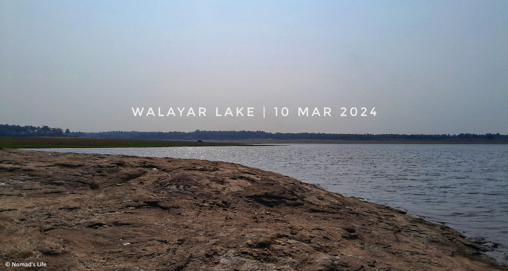

Cycling 🚴 has always been my weekend ritual — early morning rides, a massive breakfast out of exhaustion, and a well-earned rest for the day. My usual rides cover around 40 km, but I’ve always dreamed of conquering a 100 km stretch to Mazhampuzha Dam. Unfortunately, that goal remained untouched.

Last Friday, as I mapped out my weekend ride, I realized I had run out of scenic spots within my usual 25 km radius from my college hostel. That’s when a wild idea struck — a solo ride to **Walayar Dam**, covering 80 km in a single day, a potential stepping stone toward my 100 km dream. The next day, I meticulously planned the route, estimated time, and even noted down some must-visit eateries along the way. 

**10th March 2024 • Sunday: The Ride Begins**

My alarm went off at 5 AM, kicking off the adventure. Just as I was gearing up for my solo ride, an unexpected twist — my friend Vishnu decided to tag along. Little did he know, his legs and back would be cursing him by the end of the day! 

By 6 AM, we were on the road. I took my friend Harivardhan’s `FIREFOX Bad Attitude X 29D mountain bike` (which, to be fair, I used more than he did). This was the first ride I planned to track on Strava [(Activity Overview)](https://www.strava.com/activities/10930120720/overview?strava_deeplink_url=strava%3A%2F%2Factivities%2F10930120720), so with my neckband connected and a motivating Korean OST playing in the background, we set off from our college hostel in Peelamedu. 

The planned route took us through Lakshmi Mills, Ramanathapuram, and Podanur before joining **NH 544**, the Salem-Kochi Highway. However, just as we picked up the pace, Vishnu ran into a gear issue — he couldn’t shift to higher gears. Luckily, we found a bike shop near Podanur, got it fixed, and continued on our way. 

The early morning ride was pure bliss ✨ — the cool breeze against our faces, empty roads, and effortless pedaling on the smooth highway (we regretted this during return journey). We took our first break just before the L&T Tollgate, stopping for some refreshing watermelon before pushing forward. At times, it felt like our cycles had motors in them — coasting effortlessly at maximum speed of up to 39 km/h, carried by the downhill slopes and tailwinds. 

After a selfie stop near Kandhegounden Chavadi, we reached the breathtaking Walayar Lake viewpoint by 8:30 AM. Sitting near the lake water, listening to birds chirping, and stretching our legs was nothing short of therapeutic. After a 30-minute break, we continued toward Walayar Dam via the lake bridge. 

Before reaching the dam, we made a quick stop at a bakery for puffs and lemon juice — an absolute treat. Feeling refreshed, we hopped back on our cycles, only to be hit with a nasty surprise — my front tire was punctured - probably due to thorny trail of lake bridge. Just a few kilometers away from our destination, we had no choice but to turn back toward the highway, hoping to find a repair shop. 

Being a highway, there were plenty of lorry repair shops, but not a single one for cycles/bikes. Forced to search for one in nearby town - Chandrapuram, I sat on the back of Vishnu’s cycle, towing mine alongside. That’s when it hit me — if I had stuck to my original solo plan, this could have been a total disaster. Fortunately, Vishnu’s last-minute decision to join turned out to be a lifesaver. 

Eventually, we found an old grandpa’s bike shop, where he patched up the tire, albeit as a temporary fix. By this point, we were starving, so we fueled up with a breakfast of dosa, idiyappam, omelet, and kadala curry at a nearby motel. Fully recharged, we resumed our ride toward Walayar Dam, only to be met with another disappointment — it was closed! 😞

After resting in the dense forestland near the State Forest Training Institute, we decided to head back. It was 11:30 AM, and the scorching sun had no mercy on us. Knowing we’d need all the hydration we could get, we refilled our bottles with lemon juice at the same bakery before setting off. Barely a few kilometers in, disaster struck again — my tire was losing air. We stopped at a lorry repair shop, where the mechanic, surprised by our 80 km cycling adventure, patched it up once more. Little did he know, the real challenge was about to begin. 

The return journey was nothing short of torture 😫 — blazing heat, constant uphill climbs, and rapidly draining energy. Our average speed dropped to a miserable 5 km/h. We made a desperate stop for tender coconut water as our full bottles of lemon juice depleted. At one point, we were so exhausted that we took a 1.5-hour break at Hotel Aryaas, opposite the Fort of Patriotism.  

Feeling slightly better, we resumed our ride. After crossing the KG Chavadi bridge, we made another pit stop at Haryana Dhaba & Bakes for some fresh juice and much-needed chocolates—instant energy! That, along with a fried rice lunch, gave us the final boost we needed.  By 3 PM, the sun was finally behind us, making the ride slightly more bearable. However, as we neared Eachanari, our legs began trembling from exhaustion and painful due to lactic acid buildup. Pushing through the pain, we made our way back via Podanur and finally reached our hostel by 7 PM. 

After a victorious laugh 😅 at our ridiculous suffering, we rewarded ourselves with a hot water bath and some much-needed stretching to relieve tight calf muscles. But the real pain wasn’t just in our legs — our backsides felt like they had been through a war. Sitting on a chair for the next two days was pure agony! 

#### Final Thoughts

This 80 km cycling adventure was a rollercoaster of highs and lows — thrilling rides, stunning scenery, unexpected setbacks, and sheer exhaustion. Would I do it again? Probably. But one thing’s for sure — next time, I’m carrying a puncture repair kit! 🚴‍♂️🔥

