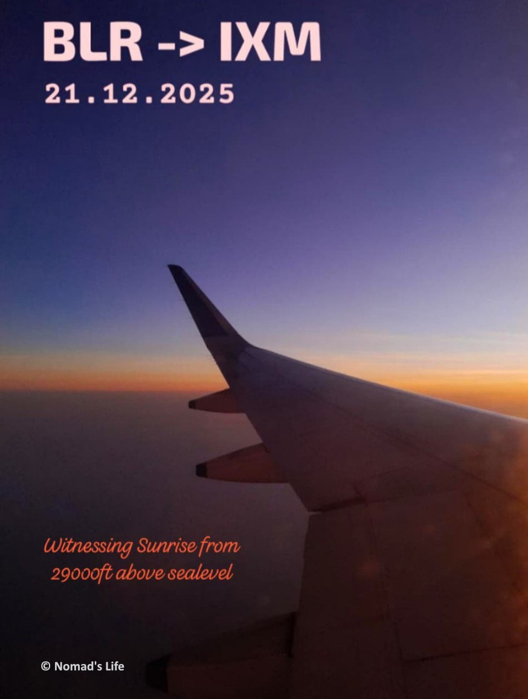

**BLR → IXM | IndiGo Airbus A320 | Window Seat 17A**

I’ve always carried a deep sense of awe and excitement for things that fly - airplanes, rockets, anything that defies gravity. For many Indians, flying at least once is a lifelong dream, and I was no different. As I write this, my mind drifts back to my childhood, when I used to build airplanes using interlocking toys and run around the house pretending to fly them.

On 21st December 2025, that childhood dream finally came true. Thanks to my job, which made me financially independent, I could experience something I had long imagined. This trip marked the beginning of my year-end vacation. My only plan was to go home, spend time with my parents, enjoy my mom’s food, take long naps in my cozy bedroom, and watch movies. While one of my friends had planned his dream trip to Spiti Valley, I chose comfort and family over adventure and I don’t regret it at all.

Still, I wanted to do something memorable. That’s when I decided to travel home by flight - something I had always wanted to try. I booked my ticket on IndiGo from Bengaluru (BLR) to Madurai (IXM) in October, and luckily the fares were quite affordable. As I write this post now, the same tickets cost two to three times more. Once the booking was done, I happily told my parents that I was finally ticking off one item from my bucket list.

#### The Journey Begins

The flight was scheduled for Sunday, 21st December, 6:00 AM. I planned to reach the airport early—around 1 to 2 AM—so that I could enter the check-in area by 3 AM and finish all the procedures calmly. Packing, however, gave me a lot of anxiety. Questions kept running in my head: What items are allowed? How do I stay within the 7 kg cabin baggage limit? I wasn’t carrying any check-in luggage—just a backpack and a laptop bag. After watching a few YouTube videos and doing some research, I finally packed my bags confidently. I also checked the KIA bus timings a day in advance since I was traveling late at night.

I left my PG at 11:00 PM (20th Dec) and headed to Shantinagar Bus Stand to catch the KIA bus to the airport. One advantage of Shantinagar is that airport buses operate 24×7. I reached there by 11:30 PM, and the place was almost deserted. It was cold, and I sat there for a while until I noticed an AC lounge meant for KIA passengers. Within five minutes, a KIA-7 bus arrived. Though it was earlier than my planned timing, I decided to board it anyway—better to wait at the airport than here.

The ticket cost ₹280. The conductor mentioned it would take about two hours to reach the airport, but I expected around 1.5 hours. As the bus moved through the sleeping city, I enjoyed the night views—majestic buildings, Phoenix Mall of Asia, and the surrounding offices looked absolutely breathtaking. To my surprise, we reached the airport in just one hour.

#### Midnight at the Airport

Now I had plenty of time to spend at the airport. I found a café on my way and decided to grab a snack. Sitting there at midnight, enjoying peri-peri French fries in the cold breeze, was an experience I can’t fully put into words. The contrast of cold air and hot food, the calm surroundings, airport lights, and distant flight sounds—it all felt surreal. I found myself romanticizing life in those moments.

I picked up my eBook and continued reading from where I had left off. It was incredibly relaxing. That’s when a thought crossed my mind—why not have a book café at airports? It would be perfect for people waiting for flights. I spent nearly an hour there with just the fries.

What made the experience even more special was learning that the café was run entirely by people with disabilities - yes, it was Mitti **Café**. Their care, confidence, and dedication deeply inspired me. We often feel broken by the smallest inconveniences in life, but their strength and positivity were truly humbling. They reminded me how resilience can bring hope to others.

Still lost in thought, I ordered a masala egg omelette and ginger chai and continued enjoying the peaceful atmosphere. Finally, I left the café around 2:00 AM.

#### Inside the Terminal

I went to the waiting area near the security entrance and confirmed that entry would be allowed after 3 AM. Meanwhile, I explored Terminal 1, which was beautifully decorated for Christmas. After taking a few photos, I sat down and indulged in one of my favorite hobbies—people watching. Everyone entering the airport seemed to carry a different story. I remembered a line I once read: 

> "Airports are places of heartfelt goodbyes, tearful hugs, and silent hopes."

I witnessed all of it that night.

At 3:00 AM, I showed my ticket and ID to CISF and entered the terminal. Since I didn’t have check-in luggage, I used the self check-in kiosk to print my boarding pass and headed straight to security. This step had worried me the most, but it turned out to be surprisingly simple. I placed my electronic items and metal belongings in trays, passed through security, and was done within five minutes.

In less than an hour, all formalities were complete. I reached my boarding gate, rested for a while, and walked around observing people sleeping on benches—reminding me of an Indian railway station. Boarding was scheduled for 5:15 AM. One small doubt I had was how to manage luggage while using the restroom, but thankfully there were designated luggage stands outside.

#### The Moment I Flew

At 5:15 AM, boarding began via bus. The bus dropped us near our IndiGo Airbus A320. Seeing the aircraft up close, surrounded by mist, felt majestic. I boarded the plane and took my window seat—17A heart pounding with excitement.

At exactly 6:00 AM, the captain began taxiing, followed by safety instructions from the crew. By 6:30 AM, after moving around the airport to reach the runway, the cabin lights dimmed. The most awaited moment had arrived.

At 6:32 AM, with a sudden acceleration, the aircraft raced down the runway and lifted off. It felt like a roller coaster. I couldn’t stop smiling—I was flying. As the plane climbed, I captured stunning views of the sky and the rising sun. Watching the sunrise from 9 km above sea level, almost at the height of Mount Everest, was unreal. The golden sky, gentle turns of the aircraft, and tiny buildings below made the experience magical. With good music in my ears, I soaked in every second.

Soon, the plane began descending—no worries, just our arrival. At 7:10 AM, we landed safely at Madurai (IXM) with the expected jolts. After deboarding, I took a few photos of the aircraft—something I couldn’t do earlier because of the mist.

And that was it.
One more item checked off my bucket list.
I flew for half an hour at 9 km above sea level—and I’ll cherish this memory forever. ✨✈️
